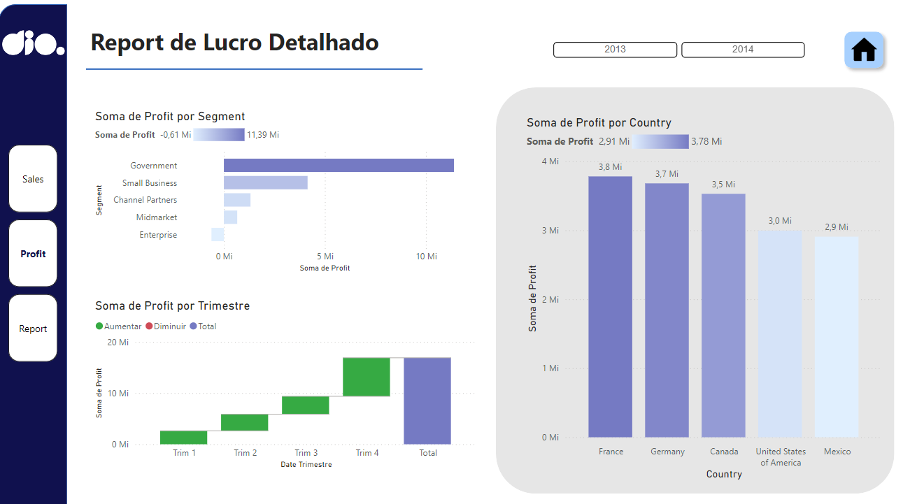
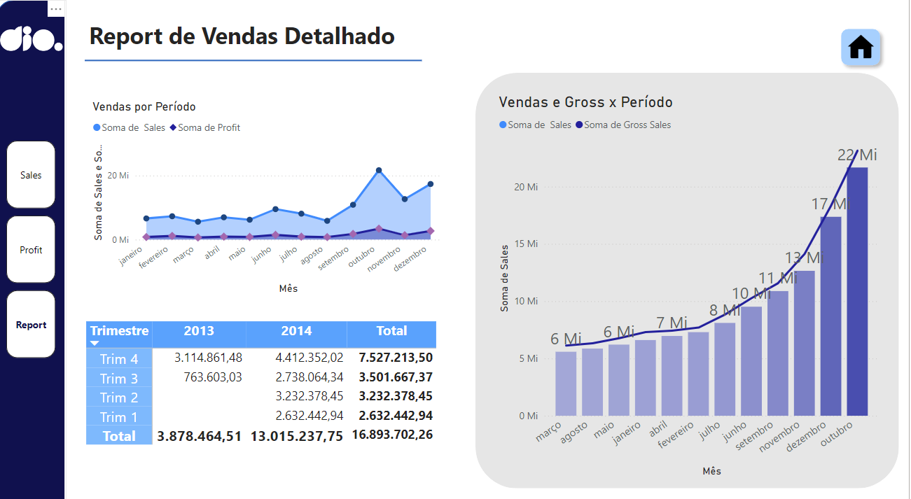

# power_example

-   **Desempenho por Produto:** O produto 'Paseo' lidera em vendas, seguido por 'VTT e 'Velo'.
-   **Crescimento Anual:** Há um aumento significativo nas vendas de 2013 para 2014.
-   **Tendência Positiva:** O aumento trimestral das vendas indica uma tendência positiva e um desempenho financeiro robusto.

-   **Crescimento Anual:** Há um aumento significativo nos lucros de 2013 para 2014.
-   **Desempenho por Segmento:** O segmento governamental lidera em termos de lucro, seguido por pequenas empresas e canais.
-   **Tendência Positiva:** O aumento trimestral dos lucros indica uma tendência positiva e um desempenho financeiro robusto.

-   **Crescimento Anual:** O ano de 2014 mostrou um crescimento significativo em comparação com 2013, indicando uma melhoria nas estratégias de vendas ou nas condições de mercado.
-   **Crescimento Mensal:** A tendência de aumento nas vendas brutas ao longo dos meses sugere uma demanda crescente ou uma expansão bem-sucedida das operações.